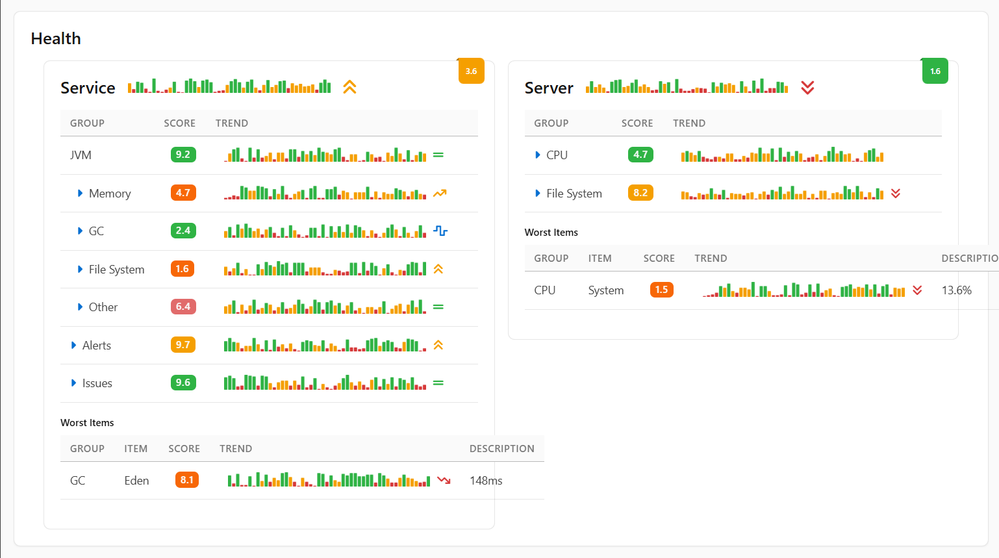
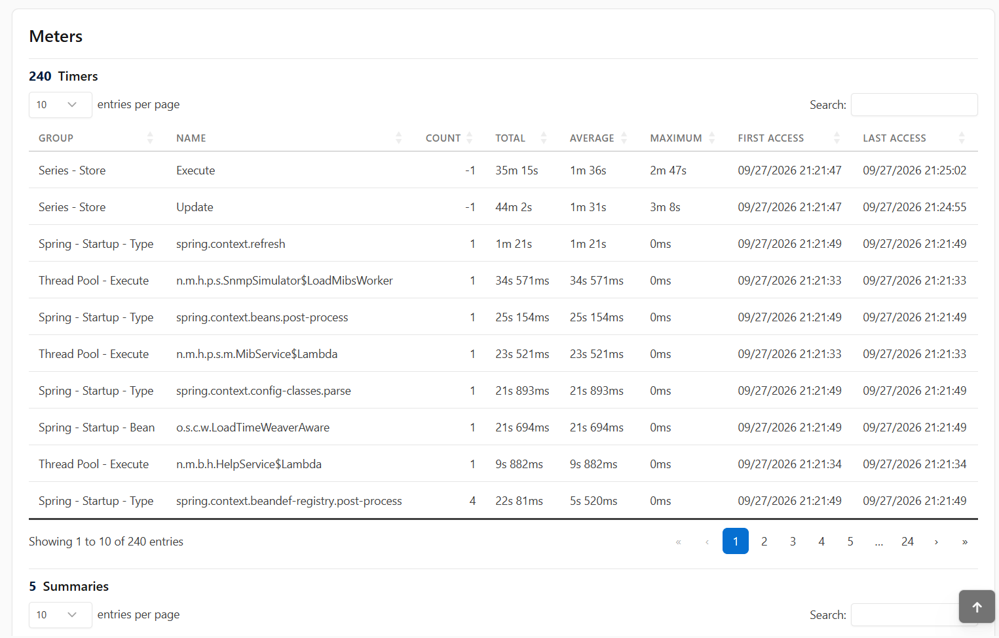
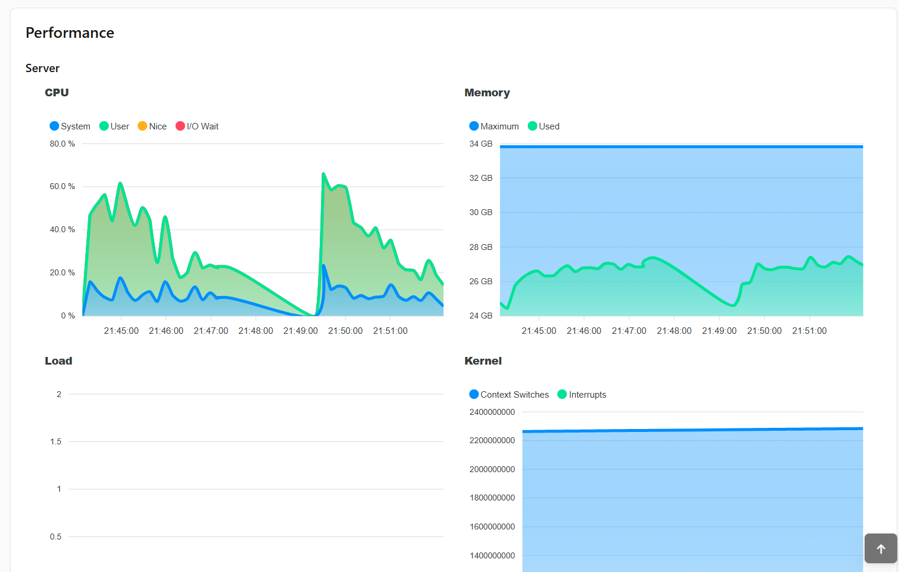
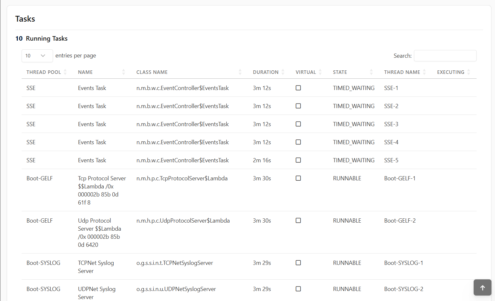

# Argus

An opinionated self-monitoring & self-diagnostics library for JVM services.

Argus lives inside your application instead of beside it: every service that depends on it becomes able to
score its own health, describe the resources it depends on, capture logging events and issues as they
happen, and render all of that into a single, self-contained HTML report. When the host application is a
Spring Boot service, Argus also exposes the same information through Actuator and, if present, through
Spring Boot Admin.

## Introduction

Most monitoring stacks answer "is it up?" from the outside, by polling an endpoint or scraping metrics into
a time-series database. Argus takes the opposite approach: the process itself continuously assesses its own
condition — memory pressure, GC pauses, disk usage, thread/file-descriptor counts, and anything a service
wants to contribute — and reduces that assessment to a single, well-defined **health score**. The score, the
detail behind it, and the resources it was computed from are always available in-process, without depending
on an external system being reachable.

This makes Argus useful in three situations that external monitoring struggles with:

* **Self-diagnostics** — a service can inspect its own health (and act on it: log, refuse traffic, restart)
  without a round-trip to an external system.
* **Self-healing** — beyond notifying administrators that a service is struggling, a service in a genuinely
  unrecoverable state (score below a configurable floor, `1.2` by default — just above `Health.MIN`) can
  self-terminate rather than keep serving traffic in a broken state, relying on the surrounding orchestration
  engine (Kubernetes, a process supervisor, ...) to restart the instance. This is the same intent behind the
  `Health.Policy.RESTART_IF_NEEDED` item policy.
* **Support/incident response** — a single HTML report, downloadable or emailed on a schedule or on
  degradation, gives a human everything needed to triage an incident, offline, without needing access to a
  monitoring stack.

## Scope

Argus is a library, not a standalone service. It is meant to be embedded in a JVM application (with or
without Spring Boot) and covers:

* Computing a **health score** for the current process, aggregated from pluggable contributors (JVM memory,
  GC, file system, services, custom checks, ...).
* Modeling the **resources** an application is made of (its own service instances, servers, and external
  dependencies such as databases or caches) and attaching health to each of them.
* Capturing **issues** (self-reported problems) and **alerts** (aggregated from logging events) so both
  voluntary and observed problems feed into diagnostics and reporting.
* Rendering a **self-contained HTML report** (metrics, health, services, logs, tasks, environment, ...) that
  can be viewed offline and sent by email/notification on a schedule or when things go wrong.
* Integrating with **Spring Boot Actuator** (a `HealthIndicator` and a `resource` endpoint) and
  **Spring Boot Admin** (UI extensions that surface the health score and the HTML report directly in SBA).

It intentionally does *not* try to be a metrics time-series store, a tracing system, or a replacement for
centralized observability — it builds on top of companion libraries (`metrics`, `tracing`, `jvm`) for the
low-level data and focuses on turning that data into a single, actionable health signal and a human-readable
report.

## Core concepts

### Health

[`Health`](api/src/main/java/net/microfalx/argus/api/Health.java) is the central concept of the library: a
rating assigned to something (a resource, a service instance, an entire site) to represent how healthy it
is. A `Health` instance is a tree of named **groups** (e.g. "JVM" → "Memory" → "Eden") whose leaves are
**items**, each with a score between `Health.MIN` (1, completely faulty) and `Health.MAX` (10, completely
healthy):

```
Score:        10 -------- 7 -------- 4 -------- 1
Thresholds:            warning     error
Areas:        healthy    with issues   faulty
```

* The score of a group (and of the `Health` instance itself) is always the score of its **worst** item —
  a single failing item is enough to drag the whole score down, mirroring how an incident actually plays out.
* `Health.Severity` translates a score into `OK` / `LOW` / `MEDIUM` / `HIGH` / `CRITICAL`, and
  `Health.Type` records what the score represents: `INSTANCE` (this process), `RESOURCE` (a resource and
  all its instances), or `SITE` (the whole application).
* `getReport()` renders a human-readable, indented text summary that highlights the group and item
  responsible for the current score — the same text used in Slack/email alerts and the actuator health
  details.
* Once built, a `Health` can be turned `readOnly()` — a defensive snapshot that is safe to hand out (e.g.
  attached to a `Resource`) without risking further mutation.

Scores are not assigned by hand: they are derived from a value and a pair of [`Thresholds`](api/src/main/java/net/microfalx/argus/api/Thresholds.java)
(a warning level and an error level, optionally reversed for metrics where *higher is better*, e.g.
available disk space). `Thresholds.getScore(value)` linearly interpolates between the configured bounds to
produce a score, which is how a raw metric (85% memory used, 350 open file descriptors, ...) becomes a
comparable `Health.Item`.

### HealthContributor and HealthService

A [`HealthContributor`](api/src/main/java/net/microfalx/argus/api/HealthContributor.java) is how a service
plugs into the scoring process: it declares which `Resource.Type` it applies to, contributes items into a
shared `Health` instance when asked (`update(Health)`), and optionally reports its own metrics
(`update(Batch)`). Argus ships several built-in contributors (see
[`core/.../contributor`](core/src/main/java/net/microfalx/argus/core/contributor)):

* `VirtualMachineHealthContributor` — JVM memory pools, GC pause times, thread and file-descriptor counts,
  file system usage.
* `ServerHealthContributor` / `ServiceHealthContributor` — host- and service-level health.
* `AlertHealthContributor` / `IssueHealthContributor` — turn active alerts/issues into health items, so a
  spike in errors or a self-reported issue is reflected in the score, not just in a side channel.

[`HealthService`](api/src/main/java/net/microfalx/argus/api/HealthService.java) is the orchestrator:
it discovers contributors and thresholds from the classpath (and accepts manual registration), scrapes them
on a schedule (`HealthSettings.scrapeInterval`, 10s by default), keeps a rolling trend per resource/group/item
(`HealthSettings.healthInterval`, 5 minutes by default), and is the single place to ask "what is the health
of X" (`getHealth(Resource.Type)`, `getHealth(Health.Type)`) or "what does X look like" (`getResource(Resource.Type)`).

### Resource

[`Resource`](api/src/main/java/net/microfalx/argus/api/Resource.java) is the other core concept: a
description of something an application depends on or is made of. Every resource has a `Type`:

| Type       | Meaning                                            |
|------------|-----------------------------------------------------|
| `SERVICE`  | The application itself (a service replica)          |
| `SERVER`   | The host/VM/container the service runs on           |
| `DATABASE` | An external database dependency                     |
| `CACHE`    | An external cache dependency                         |
| `BROKER`   | A message broker/queue dependency (Kafka, RabbitMQ, SQS, ...) |
| `STORAGE`  | An external object/blob/file storage dependency (S3, ...)     |
| `SEARCH`   | An external search engine dependency (Elasticsearch, Solr, ...) |
| `OTHER`    | Anything else worth tracking                         |

A service **registers its own resources**: `HealthService` always builds and registers a `SERVICE` resource
(itself) and a `SERVER` resource (its host), computed from the same contributors that feed the health score,
and exposes them (via the `registry` library) alongside any `DATABASE`/`CACHE`/`OTHER` resources a service
chooses to register for its external dependencies. Every resource carries a read-only `Health` snapshot and
can nest child **instances** (e.g. a clustered service's individual replicas, or a database's read replicas)
so a single `Resource` can represent both an individual instance and the aggregate of a whole fleet.

### Issues and alerts

Argus distinguishes between two ways a problem can surface:

* An [`Issue`](api/src/main/java/net/microfalx/argus/api/Issue.java) is a **voluntary** declaration — code
  explicitly calls `Issue.create(type, name)...register()` when it detects a problem (a typed category such
  as `SECURITY`, `AVAILABILITY`, `CAPACITY`, `LATENCY`, ...), with a severity, description and free-form
  attributes. Repeated occurrences of the same issue are merged (counted, timestamps widened) rather than
  duplicated.
* An [`Alert`](api/src/main/java/net/microfalx/argus/api/Alert.java) is **derived** — an aggregation built
  indirectly from events the system already produces, primarily logger events (a spike of `WARN`/`ERROR`
  log lines of the same failure type becomes a single alert with an event count).

Both are tracked by their respective services (`IssueService`, `LoggerService`/`NotificationService`) and,
through `AlertHealthContributor`/`IssueHealthContributor`, feed back into the overall health score — so an
unhandled exception or a self-reported capacity problem is visible in the same score as a JVM memory
threshold breach.

## Architecture

| Module                | Artifact                 | Purpose                                                                 |
|------------------------|---------------------------|--------------------------------------------------------------------------|
| `api`                  | `argus-api`               | Public API: `Health`, `Resource`, `Thresholds`, `Issue`, `Alert`, and the `HealthService`/`IssueService`/`LoggerService`/`NotificationService` contracts. No implementation dependencies. |
| `spi`                  | `argus-spi`               | Extension points for pluggable implementations (currently minimal).      |
| `core`                 | `argus-core`               | Default implementations of the API services, plus the built-in health contributors (JVM, server, service, alerts, issues). |
| `logger`               | `argus-logger`             | Captures logging events (Logback-based) and turns them into `LoggerEvent`s/alerts, independent of the logging framework the host application uses. |
| `report`               | `argus-report`             | Builds the self-contained HTML report (Thymeleaf-based) out of pluggable fragments; also schedules and sends the report by email/notification. |
| `spring/core`          | `argus-spring-core`        | Spring Boot bootstrapping glue: indexes Spring-managed services, and registers Spring/Hibernate/JPA/Security-aware object-size estimators so JVM memory diagnostics correctly account for framework object overhead. |
| `spring/actuator`      | `argus-spring-actuator`    | Exposes `Health` through a Spring Boot Actuator `HealthIndicator` and adds a custom `resource` endpoint. |
| `spring/sba`           | `argus-spring-sba`         | Spring Boot Admin server-side UI extensions: health badges on the wallboard/applications views and a "Health Report" tab per instance. |
| `monitor` / `inspector` / `web` | `argus-monitor` / `argus-inspector` / `argus-web` | Reserved for a future first-class web UI; currently empty placeholder modules depending on `core`. |
| `bom`                  | —                          | Bill of materials for consumers that want to align versions across the Argus modules. |

A typical dependency direction is `api` ← `core` ← `report`/`logger`, with the `spring/*` modules layering
Spring Boot auto-configuration on top of `core`/`api` without the rest of the stack needing to know Spring
exists.

## HTML report

The `report` module renders a single, self-contained HTML page (Thymeleaf templates, offline-capable —
CSS/JS can be inlined instead of loaded from a CDN) that is organized into independent **fragments**, each
contributed by a `Fragment.Provider` and rendered in isolation so one failing fragment doesn't take down the
rest of the report. The report can be generated on demand, on a daily schedule, or automatically when issues
of a given severity are detected (`ReportService`/`ReportSettings`), and — when a password is configured —
encrypted into a zip before being sent.

> The screenshots below are taken from **Heimdall** running in **demo mode**: they exist purely to show how
> each fragment renders, and every score, metric and log entry shown is randomly generated rather than
> pulled from a real, running system.

 with the Summary fragment selected")

Current sections, in display order:

1. **Summary** — headline numbers for the reporting interval, which includes the summary of the health, Issue Types, Pending Alerts and the state of the application services.

   ")

2. **Health** — the service and server `Resource`s with their computed `Health`.

   

3. **Services** — registered services/resources, their metadata and core metrics (memory, events, tasks, etc).

   ")

4. **Meters** — application metrics collected during the interval (timers, summaries, counters, etc).

   

5. **Performance** — timing/performance statistics.

   

6. **Tasks** — scheduled/background task status.

   

7. **Logger** — captured log events and alerts.

   ")

8. **Environment** — environment/system information.

   ")

> **Health Report** — a dedicated, drill-down view of the health score and its trend (already surfaced as an
> iframe-embedded tab in the Spring Boot Admin extension, see below) is planned as its own report section.
> This section will be documented here once it lands.

## Spring Boot integration

Argus ships three layered Spring modules:

* **`argus-spring-core`** provides the bootstrapping glue used by the modules above it — for example,
  making sure the `jvm` module's object-size estimator understands Spring/Hibernate/JPA/Security types
  (proxies, repositories, lazy wrappers) so the JVM memory contributor's numbers aren't skewed by framework
  overhead it doesn't recognize.
* **`argus-spring-actuator`** auto-configures:
    * `HealthHealthIndicator`, a Spring Boot Actuator `HealthIndicator` that maps the process's `Health`
      (`Health.Type.INSTANCE`) onto an Actuator `Status` (`UP`, a custom `IMPACTED` status for `HIGH`
      severity, `OUT_OF_SERVICE` for `CRITICAL`), including the score, severity, textual report and a link
      to the full HTML report as details.
    * A custom `resource` Actuator endpoint that exposes every registered `Resource`, grouped by type.
* **`argus-spring-sba`** adds Spring Boot Admin server-side UI extensions (plain JS/CSS dropped into
  `META-INF/spring-boot-admin-server-ui/extensions`, auto-loaded by SBA):
    * Health badges overlaid on the wallboard hexagons and on the applications list, both service-level
      (worst score across instances) and per-instance, without modifying SBA's own Vue components.
    * A "Health Report" tab on each instance's detail page (in the Insights group) that embeds the
      application's own HTML report in an iframe, using the `reportPath` detail published by
      `HealthHealthIndicator`.

The Wallboard is SBA's fleet-wide, at-a-glance view (one hexagon per application). Overlaying the Argus
health score there means an operator can spot a degraded application without opening it — the badge shows
the worst instance score, plus the average/max when the application has more than one instance.

")

The Applications list is where an operator drills from "something is degraded" into "which application and
which instance." The same badge is repeated at both levels — next to the application group title (aggregated)
and next to each instance row (individual) — so the worst-scoring instance is identifiable without opening
every instance's own page.

 and next to each individual instance row")

Once an operator has narrowed the problem down to one instance, the badges alone aren't enough to diagnose
it — the "Health Report" tab closes that gap by embedding that instance's own Argus HTML report (the same
report described above, with the full group/item breakdown, logs and environment) directly in SBA, without
leaving the SBA UI or needing separate access to the monitored application.

 open, showing the Argus HTML report embedded in an iframe")

Together these mean a Spring Boot application only needs `argus-spring-actuator` (and, for a fleet view,
`argus-spring-sba` on the Spring Boot Admin server) to get health scores and reports surfaced without any
custom integration code.

## Requirements

* Java 21
* Maven (multi-module reactor build, see `pom.xml`)

## License

Apache License, Version 2.0 — see [LICENSE](LICENSE).
